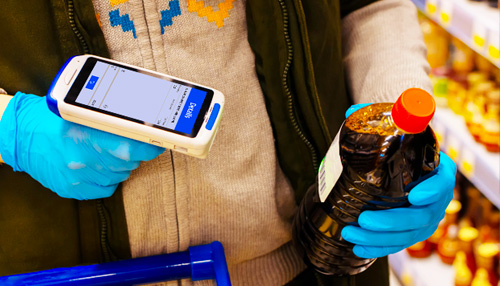

<h1 class="tc h1Title">How Dynamsoft Barcode Reader helps fight against COVID-19 in healthcare, retail and other industries</h1>

As the world continues to face the Covid-19 pandemic, innovators and governments of various countries have been trying numerous ways to contain its spread. Barcoding technology is one of them. From enabling contactless work environments to tracking testing kits to curb the Covid-19 spread, barcodes can revolutionize many processes amid the ongoing pandemic.

<h2 class="mt160 tc" style="margin-top: 160px;">User Stories</h2>

<ul class="tabList clearfix">
  <li class="fl on">Retail</li>
  <li class="fl">Healthcare</li>
</ul>

  

    <h3>Retail - Contactless Shopping</h3>
    

      

        
Lee Valley Tools is taking its in-store COVID-19 precautions a step further with the launch of a new mobile shopping tool, which incorporates the JavaScript edition of the Dynamsoft Barcode Reader. Integrated with Lee Valley's website, LeeValley.com, the new tool allows for mobile contactless shopping in each of its 20 locations across the country.

        
Over the last six months, Lee Valley Tools has enacted a variety of in-store safety measures. The launch of the new mobile feature brings an added level of safety to the in-store shopping experience.

        
The mobile feature is easy to use as customers don't need to download anything on their mobile device, instead they simply visit LeeValley.com when they enter the physical store, click on the barcode icon, select their store location, and start shopping. The online feature also allows customers to scan an item's bar code and see a full description of every product offered by Lee Valley Tools before deciding to purchase – from drills to dovetail saws.

        
"The health and safety of our customers and staff is our number one priority and our new easy-to-use mobile feature provides another layer of protection while shopping in-store during these unprecedented times," said Jason Tassé, Chief Operating Officer, Lee Valley Tools. "We're thrilled to launch this mobile tool in all our stores across Canada to give our customers a user-friendly way of making the browsing and purchase process contactless."

        
<a href="https://www.dynamsoft.com/Company/Media.aspx#2020" class="fontOswald orangeLink textUpperCase">Media coverage of the story ></a>

      

      

        
      

    

  

  

    <h3>Healthcare - Track COVID-19 Diagnostic Samples</h3>
    

      

        
We have a customer that is a New York-based company that provides services related to COVID-19 diagnostic testing and other healthcare needs. It has done millions of COVID-19 tests, using barcoding technology to track the samples because accurate recording of COVID-19 diagnostic samples is paramount.

        
The key feature that the company requires in their application is 100% accuracy in a web-based barcode scanner. Also, for maximum customer reach, the barcode scanner needs to work on mobile and desktop browsers. The company validated Dynamsoft Barcode Reader against other offerings and found it was the best option. Dynamsoft’s javascript barcode SDK offers many benefits like, ease of implementation, flexible licensing, and ease of use.

        
With the help of the barcode SDK, the healthcare company designed their application quickly, in two weeks from the point of planning to actually making it available for use.

      

      

        
      

    

  

  

<h2 class="tc mt160" style="margin-top: 160px;">Featured Content</h2>

<table class="card-table" style="margin-bottom: 160px;">
  <tr>
    <td width="33.3%" style="vertical-align: top">
      

        

        

          <h3>How Barcodes Can Help in the Fight Against Covid-19</h3>
          
From enabling contactless work environments to generating color-based ‘health codes’ to curb the Covid-19 spread, barcodes can revolutionize many processes amid the ongoing pandemic. 

          
<a class="fontOswald orangeLink textUpperCase" href="https://www.dynamsoft.com/blog/insights/how-barcodes-can-help-against-covid-19/">Read more</a>

        

      

    </td>
    <td width="33.3%" style="vertical-align: top">
      

        

        

          <h3>Adapting Building Security to Get Back to Work During COVID-19</h3>
          
As people get back to work, a major concern is ensuring only healthy workers are returning. What can businesses do to help ensure this?

          
<a class="fontOswald orangeLink textUpperCase" href="https://www.dynamsoft.com/blog/insights/adapting-building-security-get-back-to-work-during-covid-19/">Read more</a>

        

      

    </td>
    <td width="33.3%" style="vertical-align: top">
      

        

        

          <h3>The Role of Barcode Technology in Retail</h3>
          
Over the past few years, click and collect was becoming popular in North America. But COVID-19 significantly accelerated it as a strategy for retailers to consider.

          
<a class="fontOswald orangeLink textUpperCase" href="https://www.dynamsoft.com/blog/imaging/barcode/role-of-barcode-technology-in-retail/">Read more</a>

        

      

    </td>
  </tr>
</table>
