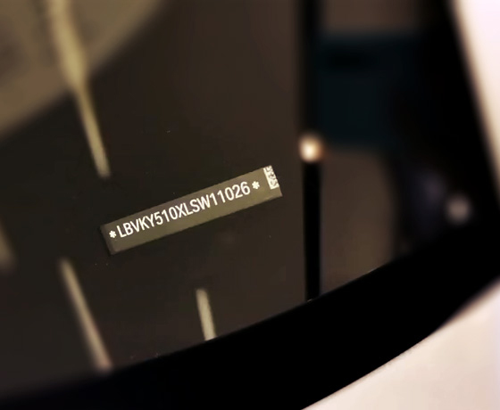
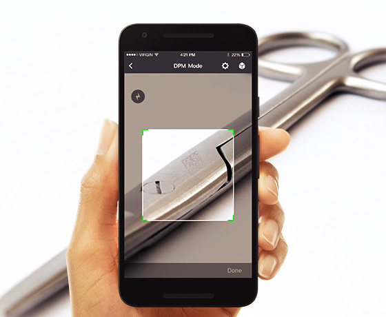
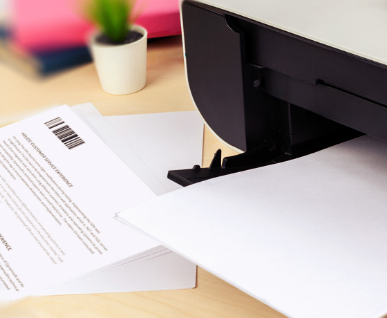
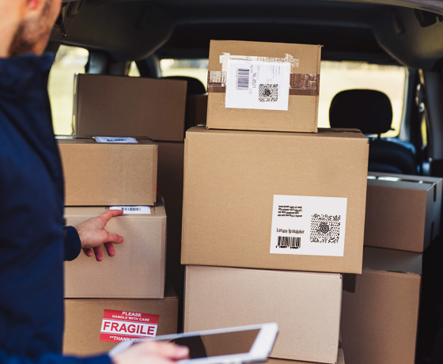
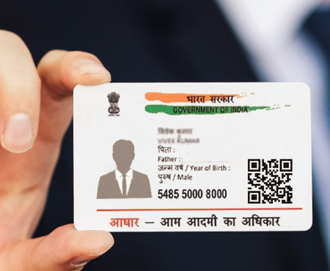

Use Cases

<h1 class="fontOswaldLight" style="text-align:center;margin-bottom:100px;">Achieving Goals Faster with Dynamsoft’s SDKs</h1>

  <ul class="pageMenuList">
    <li class="on"><a href="#multiple-codes">Multiple Codes</a></li>
    <li><a href="#vin-codes">VIN codes</a></li>
    <li><a href="#dpm-code-scanning">DPM Code Scanning</a></li>
    <li><a href="#document-management">Document Management</a></li>
    <li><a href="#parcel-tracking">Parcel Tracking</a></li>
    <li><a href="#inventory-count">Inventory Count</a></li>
    <li><a href="#ups-maxicode">UPS MaxiCode</a></li>
    <li><a href="#aadhaar-card">Aadhaar Card</a></li>
  </ul>
  

    

      
    

    

      <h2 id="multiple-codes">Multiple Codes</h2>
      
Reading dozens of barcodes in a single scan increases productivity and saves time. But when capturing an entire barcode zone from a distance, the barcodes would be relatively small, so it could be almost impossible to read all of them at once. The situation is worse when some barcodes are of questionable quality. 

      
<a
          href="https://officecn.dynamsoft.com:808/Products/barcode-inventory-system.aspx" class="orangeLink">Dynamsoft Panorama™</a> addresses the issue by breaking the process into two steps: (1) take a bird’s eye view above all the barcodes; (2) move the camera closer and sweep over the barcodes. The “partial” images will be clearer and give better barcode scanning results. The results will then be mapped to the bird’s eye view image.

    

  

  

    

      
    

    

      <h2 id="vin-codes">VIN codes</h2>
      
<a
          href="#" class="orangeLink">Vehicle Identification Numbers (VIN)</a> codes are used in the automotive industry to identify individual motor vehicles. You can spot a VIN at the base of the windshield, on the driver’s side door, and on the registration certificate. It can either be a 17-digit alphanumeric code or a subset of Code 39 barcodes. Reading VINs on a vehicle door sticker or through a windshield isn’t easy and the problem is aggravated if the windshield has stains or glare. Dynamsoft’s SDKs can rapidly scan and decode VIN codes at different distances and angles.

    

  

  

    

      
    

    

      <h2 id="dpm-code-scanning">DPM Code Scanning</h2>
      
Direct Part Marking (DPM) is used in electronics manufacturing, automotive industry, medical devices, and
        aerospace to permanently mark products and parts with crucial product information, such as part numbers, serial
        numbers, and date codes. While DPM codes help to manage and track devices and components, it can often become
        challenging to scan these etched codes because of surface imperfections, bad lighting, distortions in dots, and
        low color and contrast. Dynamsoft Barcode Reader SDK overcomes these <a
          href="https://www.dynamsoft.com/Products/direct-part-marking.aspx" class="orangeLink">DPM scanning</a> challenges by using
        proprietary algorithmic capabilities.

    

  

  

    

      
    

    

      <h2 id="document-management">Document Management</h2>
      
Document management is essential for organizations to reduce file loss, which impacts the productivity of their
        workforce. With a high recognition speed and the ability to scan a wide array of barcodes, organizations and
        professionals save time and effort.

      
Avision Inc. is a top manufacturer of image scanners and multi-function products. They adopted Dynamsoft Barcode Reader SDK to create new barcode scanning and reading software. <a
        href="https://www.dynamsoft.com/Company/case-study-Avision.aspx" class="fontOswald orangeLink textUpperCase">Read the case study</a>

      
Dynamsoft Barcode Reader SDK helped the German Red Cross Society to automate a barcode-to-PDF procedure. <a
          href="https://www.dynamsoft.com/Company/case-study-Avision.aspx" class="fontOswald orangeLink textUpperCase">Read the case study</a>

    

  

  

    

      
    

    

      <h2 id="parcel-tracking">Parcel Tracking</h2>
      
Parcel tracking involves recording the date and time of the shipment’s arrival, the location it was sent to,
        and the recipient’s name. Barcodes ensure high speed, accuracy, accountability, and efficiency. With Dynamsoft
        Barcode Reader SDK, tasks such as searching, tracking, and sorting parcels becomes much easier and faster.

      
With quick scanning of a large set of barcodes, any type of parcel can be identified in no time. The Dynamsoft
        Barcode Reader SDK helps to streamline parcel tracking and ensures that packages are delivered faster without
        errors.

    

  

  

    

      
    

    

      <h2 id="inventory-count">Inventory Count</h2>
      
To optimize your supply chain, barcode inventory systems must be controlled and overseen to be efficient and
        accurate. Missed items result in inaccurate inventory, affecting the entire chain to customers. Barcode tracking
        software must deliver precision. While most barcode readers promise high recognition accuracy, even a success
        rate of 99% may not be good enough. <a
          href="https://officecn.dynamsoft.com:808/Products/barcode-inventory-system.aspx" class="orangeLink">Dynamsoft Panorama™</a>, an
        enhanced module of the Dynamsoft Barcode Reader SDK, promises to fix the last 1% of scanning error rates that
        can collectively cost businesses billions annually.

    

  

  

    

      
    

    

      <h2 id="ups-maxicode">UPS MaxiCode</h2>
      
A 2-dimensional barcode, <a href="https://www.dynamsoft.com/Barcode-Types/MaxiCode.aspx" class="orangeLink">MaxiCode</a>, was
        developed by United Parcel Service in 1992 and is used for sorting and addressing US domestic packages, as well
        as international. MaxiCode consists of concentric circles or Bullseye, a hexagonal grid, and a fixed number of
        lines and modules.

      
Although MaxiCode has a distinct design, there may be decoding challenges. The concentric circles may get
        damaged, the orientation patterns could become distorted, or the sparse dots may confuse a barcode reader. But
        with Dynamsoft Barcode Reader SDK, users can easily scan these codes.

    

  

  

    

      
    

    

          <h2 id="aadhaar-card">Aadhaar Card</h2>
      
Issued by the Unique Identification Authority of India (UIDAI), the <a
          href="https://www.dynamsoft.com/blog/insights/how-to-extract-aadhaar-card-information/" class="orangeLink">Aadhaar card’s QR
          code</a> contains a person’s information, such as full name, date of birth, father’s name, and address.
        With Dynamsoft’s SDKs, developers can easily build a web application to scan multiple Aadhaar cards at once.
        Users can scan multiple pages, identifying which page is an Aadhaar card and saving the page as a PDF. The
        barcode SDK can decode the QR code and extract the information of the cardholder. No extra scanning device is
        required because any mobile device can be used.

    

  

