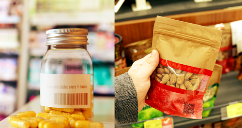
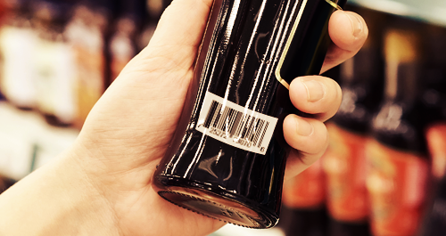
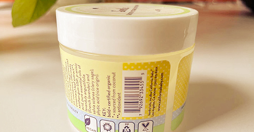
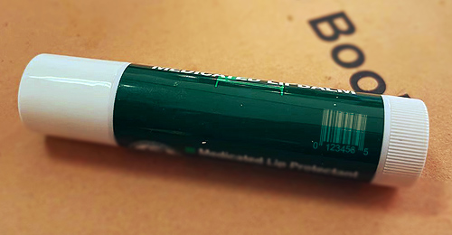
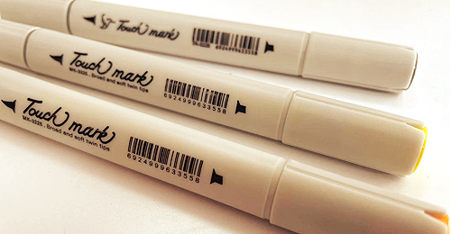
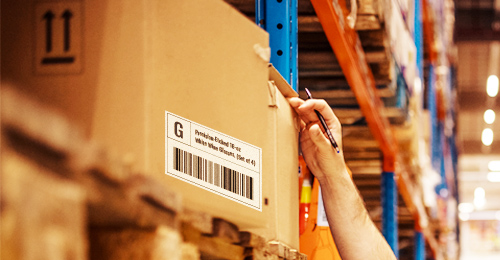
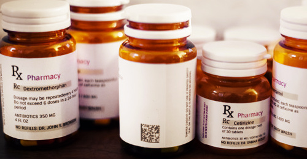
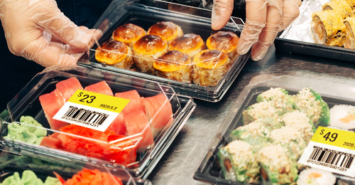

# Dynamsoft Barcode Reader in Retail

## Benefits of Robust Product Label Scanning

The barcode has long been used in retail and the possibilities for its use continue to evolve and grow. It offers many benefits including:

- Provide better retail customer experience with fast product lookup and convenient self-checkout.
- Instantly pull up product information, availability and stock location to help drive more sales.
- Reduce costs and cashier wait time by allowing customer self-checkout.

## How Dynamsoft Barcode Reader is Optimized for Retail Product Scanning

  

    

    

      <h3>Resist Wrinkles and Deformation on Packagings</h3>
      
Read product barcode on soft packagings and deformed round bottles accurately and quickly for accurate information lookup and faster self-checkout.

      
Get the <a class="orangeLink" href="https://www.dynamsoft.com/barcode-reader/introduction/how-to-guide/set-custom-area-for-accompanying-texts.html">AccompanyingTextBytes</a> and compare it with the barcode result to guarantee that there is no room for mistakes.

    

  

  

    

    

      <h3>Remove Glares on Reflective Cans</h3>
      
Grocery stores have a wide variety of products and often face issues like light glare from reflective surfaces such as from soda pop cans, condensation build up from frozen foods, and curved barcodes on canned goods.

    

  

  

    

    

      <h3>Verify via Accompanying Text</h3>
      
To ensure 100% accuracy, and eliminate manual verification, automatically verify barcode result with the accompanying text that usually appears below the product barcode.

      
Get the <a class="orangeLink" href="https://www.dynamsoft.com/barcode-reader/introduction/how-to-guide/set-custom-area-for-accompanying-texts.html">AccompanyingTextBytes</a> and compare it with the barcode result to guarantee that there is no room for mistakes.

    

  

## Featured Content

  

    

    

      
<a href="http://www.youtube.com/watch?v=fraXfsNqr24">Video: How the barcode wrinkles are corrected</a>

    

  

  

    

    

      
<a href="https://www.dynamsoft.com/Company/oceania-leading-retailer-case-study.aspx">Case study: Multi-Billion Dollar Retailer Switched to Dynamsoft Barcode Reader SDK to Realize Consumer-Grade Barcode App Performance</a>

    

  

## Most Commonly Seen Barcode Symbologies in Retail

  <ul>
    <li style="vertical-align: top" class="content-card">
      

        

        

          <h3>UPC-A</h3>
          1D Barcode
          
The 1D barcode, <a href="https://www.dynamsoft.com/Barcode-Types/UPC-A.aspx">UPC-A</a>, is widely used in retail for point-of-sale (POS) scanning. <b>You can spot a UPC-A code on many things, from consumer goods packaging to books, newspapers, and magazines.</b> Common in countries like the United States, the UK, Australia, and New Zealand, the UPC-A code encodes 12 digits of barcode data with 11 digits of product information. 

        

      

    </li>
    <li style="vertical-align: top" class="content-card">
      

        

        

          <h3>UPC-E</h3>
          1D Barcode
          
The <a href="https://www.dynamsoft.com/Barcode-Types/UPC-E.aspx">UPC-E</a> code is a variation of the UPC-A code. It is more compact because it compresses out the unnecessary zeros, making it only half the size of a UPC-A barcode. UPC-E codes can also be uncompressed back to UPC-A barcodes. <b>Because of its compact size, the UPC-E barcode is used on smaller items where the UPC-A code won’t fit, such as lip balm sticks.</b> These barcodes are extensively used in countries like the United States and Canada. 

        

      

    </li>
    <li style="vertical-align: top" class="content-card">
      

        

        

          <h3>EAN-8</h3>
          1D Barcode
          
<a href="https://www.dynamsoft.com/Barcode-Types/EAN-8.aspx">EAN-8</a> barcodes are derived from EAN-13 codes (defined below). <b>They are used on items and in places where limited space is available, such as pencils, small candies, chewing gum packets, cigarettes, etc.</b> The information enclosed in an EAN-8 barcode includes a 2-3-digit country code, a checksum digit, and 4-5 data digits. Some brands use EAN-8 barcodes to identify products exclusively sold in their stores.

        

      

    </li>    
    <li style="vertical-align: top" class="content-card">
      

        

        

          <h3>EAN-13</h3>
          1D Barcode
          
A 13-digit barcoding standard, the <a href="https://www.dynamsoft.com/Barcode-Types/EAN-13.aspx">EAN-13</a>barcode type was designed by the International Article Numbering Association (EAN) in Europe and is used extensively in European countries. EAN-13 barcodes are used for marking products and to identify specific items at retail POS. In addition to this, these barcodes can also be used for selling batches of products to consumers.

        

      

    </li>
    <li style="vertical-align: top" class="content-card">
      

        

        

          <h3 id="industrial-2-of-5">Industrial 2 of 5</h3>
          1D Barcode
          
A low-density numeric symbol, <a href="https://www.dynamsoft.com/Barcode-Types/Industrial-2-of-5.aspx">the Industrial 2 of 5 code</a>, is so-called because the digits are encoded with 5 bars, 2 of which are always wide. These codes are used in the retail warehouse sorting systems and applications. Therefore, the warehouse staff can easily find the storage location of the product and save time just by scanning the barcode.

        

      

    </li>
    <li style="vertical-align: top" class="content-card">
      

        

        

          <h3 id="code-93">Code 93</h3>
          1D Barcode
          
<a href="https://www.dynamsoft.com/Barcode-Types/Code-93.aspx">Code 93</a> was introduced by Intermec in 1982 as an improvement and complement to Code 39. It differs from Code 39, which is a continuous symbol and produces a denser code. Code 93 barcodes are used in retail inventory for identifying products. The store staff can easily manage inventory and quickly find the items they are looking for without any problems. 

        

      

    </li>
    <li style="vertical-align: top" class="content-card">
      

        

        

          <h3 id="qr-codes">QR Codes</h3>
          2D Barcodes
          
<a href="https://www.dynamsoft.com/Barcode-Types/QR-Code.aspx">QR codes</a>, or Quick Response codes, are considered one of the most versatile barcodes because they can enclose varying modes of data, such as alphanumeric, numeric, bytes, and Kanji. Because of their versatility, they are used in different processes in retail, right from product packaging to online payments, loyalty programs, feedback forms, discount coupons, marketing campaigns, etc. 

        

      

    </li>
    <li style="vertical-align: top" class="content-card">
      

        

        

          <h3 id="datamatrix">DataMatrix</h3>
          2D Barcodes
          
A 2D high-density barcode symbol, the <a href="https://www.dynamsoft.com/Barcode-Types/DataMatrix.aspx">Data Matrix code</a> is considered one of the most reliable barcodes. These barcodes support advanced error correction and checking algorithms. <strong>In retail, Data Matrix barcodes are mainly used for labeling small items, such as pill bottles.</strong> Due to the error checking and correction algorithms, these barcodes can be recognized even up to 60% damage. 

        

      

    </li>
    <li style="vertical-align: top" class="content-card">
      

        

        

          <h3 id="gs1-composite-code">GS1 Composite Code</h3>
          Composite Code
          
<a href="https://www.dynamsoft.com/Barcode-Types/GS1-Composite-Code.aspx">GS1 Composite codes</a> are a combination of a GS1 system linear symbol and a 2D composite component. The linear component is printed below the 2D composite component. These two components are separated by a separator pattern. <strong>The GS1 Composite codes, such as GS1 DataBar barcodes, are most often used for labeling fresh foods.</strong> The information often enclosed can be the expiry date or batch number of an item.  

        

      

    </li>
  </ul>
  

    <i class="prev-icon disabled"></i>
    <i class="next-icon"></i>
  

